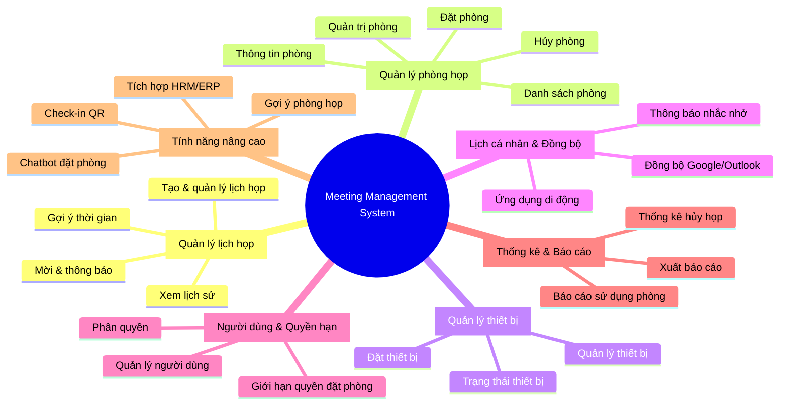
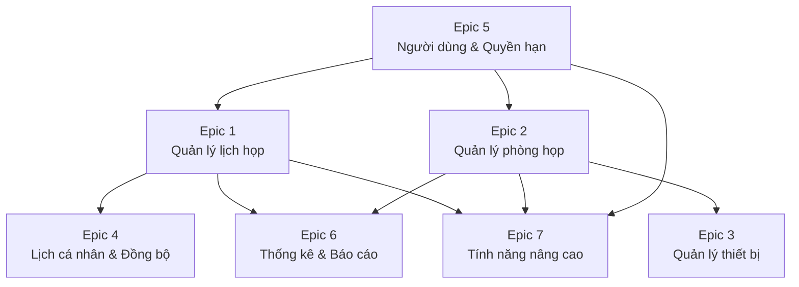
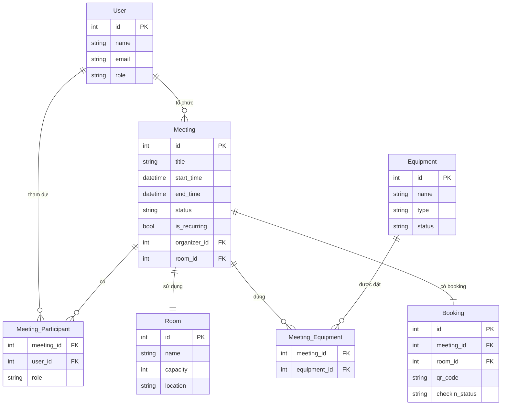

# 📋 Phân tích Product Backlog — Hệ thống Quản lý Lịch họp (ICTU)

> **Nguồn:** `Product_Backlog_Meeting_Management_ictu.xlsx` — Sheet: **Backlogs**
> **Tổng:** 28 User Stories / 7 Epics

---

## 🗂️ Tổng quan kiến trúc Epics

---

## 📌 Chi tiết từng Epic

### Epic 1 — Quản lý lịch họp (US #1–6)

| # | Feature | User Story |
|---|---------|-----------|
| 1 | Tạo và quản lý lịch họp | Nhân viên tạo lịch họp mới để lên kế hoạch với đồng nghiệp |
| 2 | Tạo và quản lý lịch họp | Nhân viên chỉnh sửa hoặc hủy lịch họp khi có thay đổi |
| 3 | Tạo và quản lý lịch họp | Nhân viên đặt lịch họp định kỳ (tuần/tháng) để không tạo lại nhiều lần |
| 4 | Mời và thông báo | Nhân viên mời người tham dự để mọi người được thông báo và chuẩn bị |
| 5 | Gợi ý thời gian | Nhân viên xem gợi ý thời gian khi mọi người đều rảnh |
| 6 | Xem lịch sử | Nhân viên xem lại lịch sử các cuộc họp đã tham gia |

**📝 Nhận xét:**
- Đây là **core feature** của hệ thống — cần ưu tiên cao nhất
- US #3 (lịch định kỳ) và US #5 (gợi ý thời gian) là các tính năng phức tạp về logic
- Cần xác định rõ quy tắc chỉnh sửa/hủy (ai được quyền, deadline hủy là bao lâu)

---

### Epic 2 — Quản lý phòng họp (US #7–11)

| # | Feature | User Story |
|---|---------|-----------|
| 7 | Quản lý danh sách phòng | Nhân viên xem danh sách phòng đang trống |
| 8 | Đặt phòng | Nhân viên đặt phòng họp theo khung giờ cụ thể |
| 9 | Hủy phòng | Nhân viên hủy đặt phòng để giải phóng cho người khác |
| 10 | Thông tin phòng | Nhân viên xem sức chứa phòng để chọn phù hợp |
| 11 | Quản trị phòng | Admin thêm/sửa/xóa phòng họp |

**📝 Nhận xét:**
- Liên kết chặt với Epic 1: đặt lịch họp → đặt phòng họp là một workflow
- US #8 và US #9 cần xử lý **conflict detection** (trùng phòng/trùng giờ)
- US #10 → cần thiết kế entity `Room` với thuộc tính sức chứa, tiện nghi

---

### Epic 3 — Quản lý thiết bị (US #12–14)

| # | Feature | User Story |
|---|---------|-----------|
| 12 | Đặt thiết bị | Nhân viên đặt kèm thiết bị (máy chiếu, TV, bảng trắng) khi đặt phòng |
| 13 | Trạng thái thiết bị | Nhân viên xem trạng thái thiết bị (có sẵn / đã đặt / bảo trì) |
| 14 | Quản lý thiết bị | Admin quản lý danh sách và trạng thái thiết bị |

**📝 Nhận xét:**
- Thiết bị có thể **không gắn cố định** với phòng → cần thiết kế linh hoạt
- 3 trạng thái thiết bị: `AVAILABLE`, `BOOKED`, `MAINTENANCE`
- US #12 → thiết bị là **optional** khi đặt phòng, không bắt buộc

---

### Epic 4 — Lịch cá nhân & Đồng bộ (US #15–17)

| # | Feature | User Story |
|---|---------|-----------|
| 15 | Đồng bộ lịch | Nhân viên đồng bộ lịch họp với Google Calendar/Outlook |
| 16 | Thông báo nhắc nhở | Nhân viên nhận thông báo qua email/app trước khi họp |
| 17 | Ứng dụng di động | Nhân viên xem lịch họp trên ứng dụng di động |

**📝 Nhận xét:**
- US #15 cần tích hợp **OAuth2** với Google/Microsoft API → phức tạp về auth
- US #16 → cần hệ thống **job scheduler** (cron job hoặc message queue)
- US #17 → xác định: web responsive hay native app? (tác động lớn đến tech stack)

---

### Epic 5 — Người dùng & Quyền hạn (US #18–21)

| # | Feature | User Story |
|---|---------|-----------|
| 18 | Quản lý người dùng | Admin tạo tài khoản người dùng mới |
| 19 | Quản lý người dùng | Admin xem danh sách tất cả người dùng |
| 20 | Phân quyền | Admin gán quyền: Admin / Người đặt lịch / Người tham dự |
| 21 | Giới hạn quyền đặt phòng | Admin hạn chế một số người dùng đặt phòng nhất định |

**📝 Nhận xét:**
- Hệ thống có **3 vai trò** rõ ràng → cần thiết kế RBAC (Role-Based Access Control)
- US #21 → cần **permission matrix**: user × room → allow/deny
- US #18–19 là prerequisite của toàn bộ hệ thống

---

### Epic 6 — Thống kê & Báo cáo (US #22–24)

| # | Feature | User Story |
|---|---------|-----------|
| 22 | Báo cáo sử dụng phòng | Admin xem báo cáo sử dụng phòng theo thời gian |
| 23 | Thống kê hủy họp | Admin xem thống kê số lượng cuộc họp bị hủy |
| 24 | Xuất báo cáo | Admin xuất báo cáo ra Excel/PDF |

**📝 Nhận xét:**
- Có thể implement bằng **aggregation queries** hoặc dedicated analytics module
- US #24 → cần thư viện xuất file: Apache POI (Java), openpyxl/reportlab (Python), etc.

---

### Epic 7 — Tính năng nâng cao (US #25–28)

| # | Feature | User Story |
|---|---------|-----------|
| 25 | Đặt phòng qua chatbot | Nhân viên đặt phòng qua chatbot không cần mở app |
| 26 | Gợi ý phòng họp | Hệ thống tự gợi ý phòng dựa trên số người tham dự |
| 27 | Check-in bằng QR | Nhân viên check-in/check-out bằng mã QR |
| 28 | Tích hợp HRM/ERP | Admin tích hợp hệ thống với HRM/ERP |

**📝 Nhận xét:**
- Đây là tính năng **low priority** / nice-to-have → có thể để Sprint cuối
- US #25 (chatbot) → cần NLP hoặc tích hợp Rasa/Dialogflow/GPT
- US #27 (QR) → mỗi booking tạo unique QR code → scan để xác nhận presence
- US #28 → phụ thuộc vào HRM/ERP cụ thể của tổ chức

---

## 📊 Phân phối User Stories theo Epic

| Epic | Số US | Tỉ lệ |
|------|-------|--------|
| Quản lý lịch họp | 6 | 21.4% |
| Quản lý phòng họp | 5 | 17.9% |
| Quản lý thiết bị | 3 | 10.7% |
| Lịch cá nhân & Đồng bộ | 3 | 10.7% |
| Người dùng & Quyền hạn | 4 | 14.3% |
| Thống kê & Báo cáo | 3 | 10.7% |
| Tính năng nâng cao | 4 | 14.3% |
| **Tổng** | **28** | **100%** |

---

## 🔗 Sơ đồ phụ thuộc (Dependency)

---

## 🏛️ Gợi ý mô hình dữ liệu (Database Entities)

---

## 🚀 Gợi ý thứ tự Sprint

| Sprint | Epic | US | Mục tiêu |
|--------|------|----|----------|
| Sprint 1 | E5 + E1 (core) | #18–21, #1–2 | Auth, CRUD lịch họp cơ bản |
| Sprint 2 | E2 + E3 | #7–14 | Quản lý phòng & thiết bị |
| Sprint 3 | E1 (nâng cao) | #3–6 | Lịch định kỳ, mời, gợi ý |
| Sprint 4 | E4 + E6 | #15–17, #22–24 | Thông báo, đồng bộ, báo cáo |
| Sprint 5 | E7 | #25–28 | Tính năng nâng cao |
