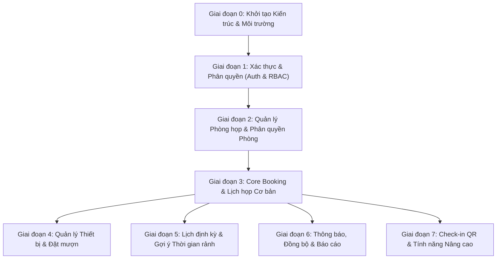

# 🗺️ Lộ trình Phát triển Dự án Hệ thống Quản lý Lịch họp (ICTU Meeting Management)

> **Tài liệu tham chiếu:**
> - Backlog: [`backlog_analysis.md`](file:///d:/TTCS/backlog_analysis.md) (28 User Stories / 7 Epics)
> - Database kiến trúc gợi ý: [`database.drawio`](file:///d:/TTCS/database.drawio) (10 Entities)
>
> **Nguyên tắc phát triển:**
> 1. **Incremental & Modular**: Làm đến đâu, chạy được và kiểm thử được đến đó (End-to-End).
> 2. **Dependency-First**: Xây dựng phần hạ tầng và dữ liệu gốc trước (User, Role, Room) rồi mới xây dựng các nghiệp vụ phụ thuộc (Booking, Equipment, Report).
> 3. **Fail-safe Booking**: Ưu tiên cao nhất cho tính đúng đắn của logic chống trùng lịch (Conflict Detection & Concurrency Control).

---

## 🧭 Tổng quan các Giai đoạn (Phases Overview)

| Phase | Tên giai đoạn | Epics liên quan | Trọng tâm bàn giao | Độ ưu tiên |
| :---: | :--- | :--- | :--- | :---: |
| **Phase 0** | Khởi tạo Dự án & Kiến trúc | Hạ tầng | Project skeleton, DB migration, Docker, Config | ⚡ Bắt buộc |
| **Phase 1** | Xác thực & Quản lý Người dùng | **Epic 5** | Login/Register, JWT/Session, RBAC, User CRUD | 🔴 Rất cao |
| **Phase 2** | Quản lý Phòng họp | **Epic 2, Epic 5** | Danh mục phòng, Sức chứa, Giới hạn phòng theo Role | 🔴 Rất cao |
| **Phase 3** | Core Booking & Lịch họp cơ bản | **Epic 1, Epic 2** | Đặt phòng, Conflict Detection, Mời người, Hủy/Duyệt | 🔴 Cốt lõi (MVP) |
| **Phase 4** | Quản lý Thiết bị | **Epic 3** | CRUD Thiết bị cố định/di động, Đặt kèm theo họp | 🟡 Trung bình |
| **Phase 5** | Lịch định kỳ & Thuật toán rảnh | **Epic 1 (Nâng cao)** | Recurrence Rule (Tuần/Tháng), Gợi ý slot rảnh | 🟡 Trung bình |
| **Phase 6** | Thông báo & Báo cáo thống kê | **Epic 4, Epic 6** | Email nhắc nhở, iCal sync, Dashboard & Xuất Excel | 🟢 Khá |
| **Phase 7** | QR Check-in & Tính năng mở rộng | **Epic 7** | Quét QR điểm danh, Gợi ý phòng AI, Chatbot | ⚪ Nâng cao |

---

## 🛠️ Chi tiết từng Giai đoạn triển khai

---

### 🚀 Giai đoạn 0: Khởi tạo Kiến trúc & Môi trường (Foundation Setup)
*Mục tiêu: Thiết lập khung dự án, cơ sở dữ liệu, quy chuẩn mã nguồn và quy trình kiểm thử.*

- [x] **0.1. Chọn và thống nhất Tech Stack:**
  - **Backend:** Python (FastAPI), SQLAlchemy 2.0, Pydantic v2, PyJWT, Uvicorn.
  - **Database:** SQLite (local dev `meetings.db`) / PostgreSQL (production-ready).
- [x] **0.2. Cấu trúc thư mục:** `backend/` theo chuẩn modular kiến trúc Clean Architecture.
- [x] **0.3. Cấu hình Database & Seeding:** Tự động tạo bảng và nạp dữ liệu khởi tạo khi server chạy.
- [x] **0.4. Thiết lập Biến môi trường:** File `.env.example`, `.env`.
- [x] **Kết quả đầu ra (DoD):** Server chạy được `GET /health`, kết nối thành công Database và Swagger UI `/docs`.

---

### 🔐 Giai đoạn 1: Xác thực & Quản lý Người dùng (Auth & RBAC — Epic 5)
*Mục tiêu: Đảm bảo chỉ người dùng hợp lệ mới truy cập được hệ thống và có đúng vai trò tương ứng.*

- **User Stories liên quan:**
  - US #18: Admin tạo tài khoản người dùng mới.
  - US #19: Admin xem danh sách tất cả người dùng.
  - US #20: Phân quyền (Admin, Organizer, Participant).
- **Cơ sở dữ liệu:**
  - Bảng `roles`: `role_id`, `role_name` (`ADMIN`, `ORGANIZER`, `PARTICIPANT`).
  - Bảng `departments`: `department_id`, `department_name`, `hrm_code`, `created_at`.
  - Bảng `users`: `user_id`, `role_id`, `department_id`, `full_name`, `email`, `password_hash`, `phone`, `status`, `created_at`, `updated_at`.
- **Nhiệm vụ cụ thể:**
  - [x] **1.1. Backend Auth:**
    - API Đăng nhập (`POST /api/v1/auth/login`) trả về Access Token JWT + Thông tin vai trò.
    - API OAuth2 Token Form (`POST /api/v1/auth/token-login`) hỗ trợ nút Authorize trực tiếp trên Swagger UI.
    - API Lấy profile người dùng hiện tại (`GET /api/v1/auth/me`).
    - API Đổi mật khẩu (`POST /api/v1/auth/change-password`).
    - Middleware xác thực JWT và phân quyền RBAC (`get_current_active_user`, `require_roles(["ADMIN"])`).
  - [x] **1.2. Backend User & Department Management:**
    - API CRUD User (chỉ Admin truy cập): `GET`, `POST`, `PUT`, `DELETE /api/v1/users` (hỗ trợ tìm kiếm, lọc theo vai trò, phòng ban).
    - API Danh sách phòng ban: `GET /api/v1/departments`, `POST /api/v1/departments` (Admin).
    - API Danh sách vai trò: `GET /api/v1/roles`.
  - [ ] **1.3. Frontend Auth & Admin User UI:**
    - Trang Đăng nhập (Login form, validate, thông báo lỗi).
    - Quản lý trạng thái đăng nhập (Token/Cookie).
    - Trang Admin: Quản lý danh sách người dùng.
- [x] **Kết quả đầu ra (DoD):** Đã kiểm thử tự động 9/9 test case (`test_phase1.py` PASS). Admin đăng nhập tạo được tài khoản cho nhân viên; bảo vệ quyền RBAC chặn trái phép 403 Forbidden chính xác.

---

### 🏢 Giai đoạn 2: Quản lý Danh mục Phòng họp & Giới hạn đặt phòng (Room Management — Epic 2 & US #21)
*Mục tiêu: Xây dựng kho dữ liệu phòng họp vật lý và chính sách ai được đặt phòng nào.*

- **User Stories liên quan:**
  - US #7: Nhân viên xem danh sách phòng đang trống.
  - US #10: Nhân viên xem sức chứa, thông tin phòng.
  - US #11: Admin thêm/sửa/xóa phòng họp.
  - US #21: Giới hạn quyền đặt phòng theo vai trò (hoặc phòng ban).
- **Cơ sở dữ liệu:**
  - Bảng `rooms`: `room_id`, `room_name`, `capacity`, `location`, `status` (`AVAILABLE`, `MAINTENANCE`), `description`, `created_at`, `updated_at`.
  - Bảng `room_restrictions`: `restriction_id`, `room_id`, `role_id`, `notes`.
- **Nhiệm vụ cụ thể:**
  - [x] **2.1. Backend Room APIs:**
    - API CRUD Phòng họp (chỉ Admin): `POST`, `PUT`, `DELETE /api/v1/rooms` (US #11).
    - API Xem danh sách phòng họp: `GET /api/v1/rooms` (hỗ trợ tìm kiếm, lọc theo sức chứa min/max, trạng thái, và bộ lọc `only_allowed_for_me` kiểm tra vai trò) (US #7, US #10, US #21).
    - API Chi tiết phòng họp: `GET /api/v1/rooms/{id}`.
    - API Quản lý giới hạn quyền đặt phòng theo vai trò (chỉ Admin): `POST /api/v1/rooms/{id}/restrictions`, `DELETE .../restrictions/{id}` (US #21).
  - [ ] **2.2. Frontend Room Management & Catalog:**
    - Trang danh sách phòng dạng Card hoặc Grid: hiển thị hình ảnh, tên phòng, sức chứa, địa điểm, huy hiệu trạng thái.
    - Modal/Trang chi tiết phòng: tiện ích đi kèm, giới hạn quyền.
    - Trang Quản trị phòng họp dành riêng cho Admin.
- [x] **Kết quả đầu ra (DoD):** Đã kiểm thử tự động 11/11 test case (`test_phase2.py` PASS). Tự động nạp sẵn 6 phòng họp mẫu và cấu hình giới hạn quyền phòng Ban Giám hiệu; Admin toàn quyền CRUD phòng, non-admin bị chặn 403 Forbidden.

---

### 📅 Giai đoạn 3: Core Booking & Lịch họp Cơ bản (Meeting Core — Epic 1 & Epic 2)
> ⚠️ **ĐÂY LÀ TRỌNG TÂM CỐT LÕI CỦA TOÀN DỰ ÁN (MVP)**

- **User Stories liên quan:**
  - US #1: Nhân viên tạo lịch họp mới.
  - US #2: Nhân viên chỉnh sửa hoặc hủy lịch họp.
  - US #4: Mời người tham dự cuộc họp.
  - US #8: Nhân viên đặt phòng theo khung giờ cụ thể.
  - US #9: Nhân viên hủy đặt phòng.
- **Cơ sở dữ liệu:**
  - Bảng `MEETING`: `meeting_id`, `organizer_id`, `room_id`, `title`, `description`, `start_time`, `end_time`, `status` (`SCHEDULED`, `IN_PROGRESS`, `COMPLETED`, `CANCELLED`), `created_at`.
  - Bảng `MEETING_PARTICIPANT`: `participant_id`, `meeting_id`, `user_id`, `status` (`PENDING`, `ACCEPTED`, `DECLINED`).
- **Nhiệm vụ cụ thể:**
  - [x] **3.1. Thuật toán phát hiện trùng lịch (Conflict Detection):**
    - Kiểm tra trước khi insert: Không tồn tại cuộc họp nào ở cùng `room_id` có `status != 'CANCELLED'` thỏa mãn:
      $$\text{Existing.start\_time} < \text{New.end\_time} \quad\text{VÀ}\quad \text{Existing.end\_time} > \text{New.start\_time}$$
    - Xử lý Database Transaction / Row-level locking để chống Race Condition khi 2 người cùng bấm đặt cùng lúc.
  - [x] **3.2. Backend Booking APIs:**
    - `POST /api/v1/meetings`: Tạo lịch họp + gán phòng + gửi lời mời người tham gia.
    - `GET /api/v1/meetings`: Xem lịch (lọc theo ngày, phòng, hoặc cá nhân).
    - `GET /api/v1/rooms/{id}/availability?date=YYYY-MM-DD`: Lấy timeline các khung giờ đã bị đặt và còn trống của phòng.
    - `PUT /api/v1/meetings/{id}`: Chỉnh sửa cuộc họp (chỉ Organizer hoặc Admin).
    - `DELETE /api/v1/meetings/{id}` hoặc `PATCH .../cancel`: Hủy cuộc họp.
    - `PATCH /api/v1/meetings/{id}/respond`: Khách mời phản hồi (Accept/Decline).
  - [x] **3.3. Frontend Calendar & Booking UI (UI Layout Optimized):**
    - Giao diện Lịch trực quan (được thiết kế bằng Grid chuẩn theo nhận diện ICTU Tech Blue).
    - Modal đặt phòng: Chọn phòng -> Chọn ngày giờ -> Nhập tiêu đề/nội dung -> Chọn người tham dự.
    - Hiển thị trực quan các slot đã bị đặt (Tech Blue), slot trống (Light Slate) và slot giới hạn (Red Hatched).
    - Trang "Lịch họp của tôi" (My Meetings): Danh sách các cuộc họp tôi tổ chức và được mời.
- [x] **Kết quả đầu ra (DoD):** Đã kiểm thử tự động toàn diện (`test_phase3.py` PASS). Một nhân viên có thể vào xem phòng trống, đặt lịch, mời 2 người đồng nghiệp; nếu người khác cố tình đặt đè vào giờ đó thì hệ thống sẽ báo lỗi trùng lịch chính xác (409 Conflict).

---

### 📽️ Giai đoạn 4: Quản lý Thiết bị & Đặt mượn kèm phòng (Equipment — Epic 3)
*Mục tiêu: Hỗ trợ người dùng mượn thêm máy chiếu, micro, bảng trắng... khi đặt phòng.*

- **User Stories liên quan:**
  - US #12: Nhân viên đặt kèm thiết bị khi đặt phòng.
  - US #13: Nhân viên xem trạng thái thiết bị.
  - US #14: Admin quản lý danh sách và trạng thái thiết bị.
- **Cơ sở dữ liệu:**
  - Bảng `EQUIPMENT`: `equipment_id`, `room_id` (nullable), `equipment_name`, `type`, `status` (`AVAILABLE`, `BOOKED`, `MAINTENANCE`).
  - Bảng `MEETING_EQUIPMENT`: `meeting_id`, `equipment_id`, `quantity`.
- **Nhiệm vụ cụ thể:**
  - [ ] **4.1. Phân loại thiết bị:**
    - Thiết bị cố định: Gắn liền với phòng (`room_id != null`) -> Tự động đi kèm khi đặt phòng đó.
    - Thiết bị lưu động: Thuộc kho chung (`room_id = null`) -> Cho phép chọn số lượng cần mượn thêm.
  - [ ] **4.2. Backend APIs:**
    - CRUD Thiết bị (Admin): `POST`, `PUT`, `DELETE /api/v1/equipments`.
    - Tích hợp kiểm tra tồn kho thiết bị lưu động vào flow tạo `POST /api/v1/meetings`.
  - [ ] **4.3. Frontend:**
    - Tab quản lý thiết bị cho Admin.
    - Bước chọn thiết bị bổ sung trong form tạo cuộc họp.
- [ ] **Kết quả đầu ra (DoD):** Khi tạo lịch họp, người dùng tích chọn "Máy chiếu di động", hệ thống ghi nhận và trừ số lượng khả dụng trong khung giờ đó.

---

### 🔄 Giai đoạn 5: Lịch định kỳ & Tối ưu thời gian họp (Advanced Scheduling — Epic 1 nâng cao)
*Mục tiêu: Tiết kiệm thời gian cho các cuộc họp lặp lại hàng tuần và tìm khung giờ rảnh chung.*

- **User Stories liên quan:**
  - US #3: Đặt lịch họp định kỳ (hàng tuần/hàng tháng).
  - US #5: Gợi ý thời gian khi tất cả mọi người đều rảnh.
  - US #6: Xem lịch sử cuộc họp đã tham gia.
- **Nhiệm vụ cụ thể:**
  - [ ] **5.1. Lịch định kỳ (Recurring Meetings):**
    - Logic sinh lịch: Lưu `is_recurring = true`, `recurrence_rule` (theo chuẩn iCal RRule hoặc đơn giản: frequency, interval, until_date).
    - Tạo các bản ghi con hoặc dynamic expansion để kiểm tra conflict cho tất cả các ngày trong chuỗi lặp.
  - [ ] **5.2. Thuật toán Gợi ý thời gian rảnh (Free-busy Finder):**
    - Input: Danh sách `user_id` người tham gia, thời lượng họp (vd: 60 phút), khoảng ngày cần tìm.
    - Logic: Lấy union lịch bận của tất cả khách mời -> Tìm ra các khoảng trống giao nhau có thời lượng đủ 60 phút.
  - [ ] **5.3. Frontend:**
    - Checkbox "Cuộc họp định kỳ" và các tùy chọn chu kỳ.
    - Nút "Tìm giờ rảnh chung" hỗ trợ xếp lịch nhanh.
- [ ] **Kết quả đầu ra (DoD):** Tạo được lịch họp giao ban lặp lại mỗi sáng Thứ Hai hàng tuần trong 1 tháng; hệ thống tự động tìm được khung giờ rảnh của 5 người.

---

### 🔔 Giai đoạn 6: Thông báo, Đồng bộ Lịch & Báo cáo Thống kê (Notifications & Analytics — Epic 4 & Epic 6)
*Mục tiêu: Đảm bảo không ai bị quên giờ họp và cung cấp số liệu phân tích cho ban quản lý.*

- **User Stories liên quan:**
  - US #15: Đồng bộ Google Calendar/Outlook.
  - US #16: Thông báo nhắc nhở qua Email/App trước khi họp.
  - US #22: Báo cáo sử dụng phòng theo thời gian.
  - US #23: Thống kê số lượng cuộc họp bị hủy.
  - US #24: Xuất báo cáo ra Excel/PDF.
- **Nhiệm vụ cụ thể:**
  - [ ] **6.1. Hệ thống Thông báo (Notification Engine):**
    - Cấu hình SMTP gửi email (Nodemailer, JavaMail, SendGrid,...).
    - Tự động gửi email khi: Được mời họp, Cuộc họp bị thay đổi/hủy.
    - Chạy Worker/Cron Job định kỳ mỗi 5 phút quét các cuộc họp sắp diễn ra trong 15 phút tới để gửi mail nhắc nhở.
  - [ ] **6.2. Đồng bộ Calendar (iCal feed):**
    - Xuất file `.ics` đính kèm email để người dùng bấm 1 click thêm vào Google/Apple Calendar.
  - [ ] **6.3. Dashboard & Xuất Báo cáo:**
    - Truy vấn tổng hợp (Aggregation queries): Tỷ lệ lấp đầy của từng phòng (giờ sử dụng / giờ làm việc), phòng họp nào hot nhất, tỷ lệ hủy.
    - Vẽ biểu đồ trực quan (Chart.js / Recharts).
    - Xuất file Excel (thư viện `exceljs`, `openpyxl`, hoặc `Apache POI`).
- [ ] **Kết quả đầu ra (DoD):** Trước giờ họp 15 phút nhận được email nhắc; Admin xem được biểu đồ tần suất dùng phòng tháng vừa qua và bấm tải file Excel.

---

### 📱 Giai đoạn 7: Check-in QR & Tính năng Mở rộng (Advanced Features — Epic 7)
*Mục tiêu: Số hóa quy trình ra vào phòng họp và các tiện ích nâng cao.*

- **User Stories liên quan:**
  - US #27: Check-in bằng QR code.
  - US #26: Tự động gợi ý phòng họp phù hợp sức chứa.
  - US #25: Đặt phòng qua Chatbot.
  - US #28: Tích hợp HRM/ERP.
- **Cơ sở dữ liệu:**
  - Bảng `CHECK_IN_LOG`: `log_id`, `meeting_id`, `user_id`, `check_in_time`, `check_out_time`, `qr_code_data`.
- **Nhiệm vụ cụ thể:**
  - [ ] **7.1. Check-in QR Code:**
    - Sinh mã QR động cho từng cuộc họp hoặc mã QR tĩnh dán trước cửa phòng.
    - Nhân viên mở điện thoại quét mã -> API xác nhận điểm danh -> Lưu vào `CHECK_IN_LOG`.
    - Tự động hủy phòng nếu sau 15 phút bắt đầu không có ai check-in (giải phóng phòng trống cho người khác).
  - [ ] **7.2. Gợi ý phòng thông minh:**
    - Khi người dùng nhập 12 người tham dự, hệ thống tự động ưu tiên gợi ý các phòng có sức chứa từ 12–15 chỗ, tránh gợi ý phòng 50 chỗ gây lãng phí.
  - [ ] **7.3. Chatbot & HRM Integration (Khuyến nghị để cuối cùng):**
    - Tích hợp đăng nhập SSO qua hệ thống trường học/doanh nghiệp.
- [ ] **Kết quả đầu ra (DoD):** Người tham gia quét mã QR điểm danh thành công trên ứng dụng web/mobile.

---

## 🎯 Kế hoạch Thực hiện ngay hôm nay: Bắt đầu từ Bước 1

Để bắt tay vào code ngay mà không bị quá tải, hãy thực hiện theo thứ tự 3 bước sau:

1. **Bước 1 (Hôm nay):** Setup Backend & Database với 3 bảng đầu tiên: `ROLE`, `DEPARTMENT`, `USER`. Viết API Đăng nhập và CRUD User.
2. **Bước 2 (Tiếp theo):** Tạo bảng `ROOM`, viết API thêm phòng và xem danh sách phòng.
3. **Bước 3 (Quan trọng):** Tạo bảng `MEETING` và xây dựng thuật toán chống trùng phòng (Conflict Detection). Khi bước này hoàn thành, dự án đã có 70% giá trị cốt lõi!
